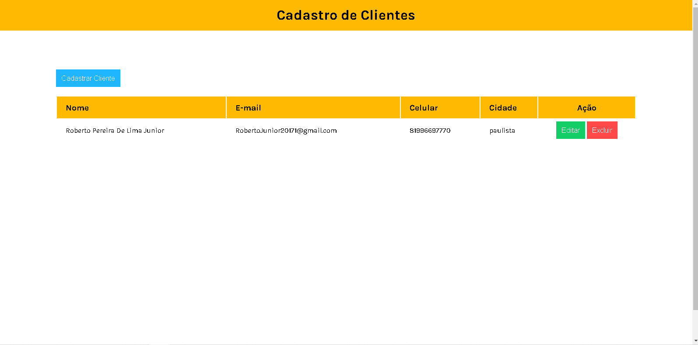

<h1 align="center"> Cadastro de funcionários em js  </h1>

  <a href="#-tecnologias">Tecnologias</a>&nbsp;&nbsp;&nbsp;|&nbsp;&nbsp;&nbsp;
  <a href="#-projeto">Projeto</a>&nbsp;&nbsp;&nbsp;|&nbsp;&nbsp;&nbsp;
  <a href="#memo-licença">Licença</a>

  

 

  

## 🚀 Tecnologias

Esse projeto foi desenvolvido com as seguintes tecnologias:

- HTML e CSS
- JavaScript

## 💻 Projeto

Crud desenvolvido em Js com o intuito de cadastro de pessoas, constamente vou ficar atualizando o projeto e adicionando novas funcionalidades. 

## :memo: Licença

Esse projeto está sob o dominío Hobyn
